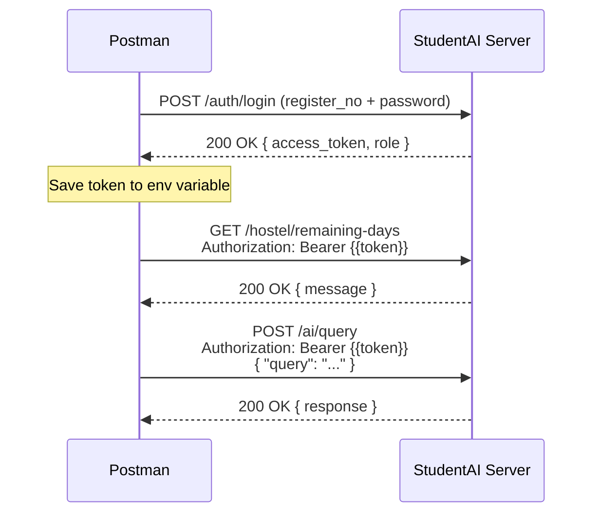

# 📘 StudentAI Backend — API Documentation

> **Base URL:** `http://localhost:8000`
> **Authentication:** JWT Bearer Token (obtained via `/auth/login`)
> **Content-Type:** `application/json`

---

## 🔧 Postman Setup

### Environment Variables

Create a Postman Environment called **StudentAI Local** with these variables:

| Variable      | Initial Value              | Description                |
|---------------|----------------------------|----------------------------|
| `base_url`    | `http://localhost:8000`    | API base URL               |
| `token`       | *(leave empty)*            | Auto-set after login       |

### Auto-set Token After Login

In the **Login** request's **Tests** tab, paste this script so the token is automatically saved:

```javascript
if (pm.response.code === 200) {
    var jsonData = pm.response.json();
    pm.environment.set("token", jsonData.access_token);
}
```

---

## 📑 Endpoints Overview

| #  | Method | Endpoint              | Auth Required | Description                       |
|----|--------|-----------------------|---------------|-----------------------------------|
| 1  | GET    | `/`                   | ❌            | Health check                      |
| 2  | POST   | `/auth/login`         | ❌            | Student login, returns JWT        |
| 3  | GET    | `/hostel/remaining-days` | ✅         | Get remaining hostel days         |
| 4  | GET    | `/hostel/details`     | ✅            | Get hostel allocation details     |
| 5  | POST   | `/hostel/leave`       | ✅            | Apply for hostel leave            |
| 6  | POST   | `/ai/query`           | ✅            | Send natural language query to AI |
| 7  | POST   | `/reload-tools`       | ❌            | Reload tool registry from DB     |

---

## 1️⃣ Health Check

> Quick check to see if the server is running.

| Property | Value |
|----------|-------|
| **Method** | `GET` |
| **URL** | `{{base_url}}/` |
| **Auth** | None |
| **Body** | None |

### ✅ Success Response `200 OK`

```json
{
    "message": "Welcome to StudentAI"
}
```

---

## 2️⃣ Login

> Authenticates a student and returns a JWT access token.

| Property | Value |
|----------|-------|
| **Method** | `POST` |
| **URL** | `{{base_url}}/auth/login` |
| **Auth** | None |
| **Content-Type** | `application/json` |

### Request Body

```json
{
    "register_no": "RA2211003010001",
    "password": "password"
}
```

| Field         | Type   | Required | Description                                    |
|---------------|--------|----------|------------------------------------------------|
| `register_no` | string | ✅       | Student's registration number from the DB      |
| `password`    | string | ✅       | Student's password (`"password"` works for test data with `hashed_password` in DB) |

### ✅ Success Response `200 OK`

```json
{
    "access_token": "eyJhbGciOiJIUzI1NiIsInR5cCI6IkpXVCJ9...",
    "token_type": "bearer",
    "role": "student"
}
```

### ❌ Error Responses

**401 Unauthorized — Wrong register number:**
```json
{
    "detail": "Incorrect register number"
}
```

**401 Unauthorized — Wrong password:**
```json
{
    "detail": "Incorrect password"
}
```

> [!TIP]
> Copy the `access_token` value and use it as a Bearer token for all authenticated endpoints. If you set up the Postman test script above, this happens automatically.

---

## 3️⃣ Get Remaining Hostel Days

> Returns how many days the student has remaining in their current hostel allocation.

| Property | Value |
|----------|-------|
| **Method** | `GET` |
| **URL** | `{{base_url}}/hostel/remaining-days` |
| **Auth** | Bearer Token |

### Postman Auth Setup

| Tab       | Setting         | Value                  |
|-----------|-----------------|------------------------|
| **Auth**  | Type            | `Bearer Token`         |
|           | Token           | `{{token}}`           |

### ✅ Success Response `200 OK`

```json
{
    "message": "You have 142 days remaining in the hostel."
}
```

### ⚠️ No Active Allocation

```json
{
    "message": "You do not have an active hostel allocation with an end date."
}
```

### ❌ Error Response `401 Unauthorized`

```json
{
    "detail": "Could not validate credentials"
}
```

---

## 4️⃣ Get Hostel Details

> Returns the student's hostel name, room number, and pending dues.

| Property | Value |
|----------|-------|
| **Method** | `GET` |
| **URL** | `{{base_url}}/hostel/details` |
| **Auth** | Bearer Token |

### Postman Auth Setup

| Tab       | Setting         | Value                  |
|-----------|-----------------|------------------------|
| **Auth**  | Type            | `Bearer Token`         |
|           | Token           | `{{token}}`           |

### ✅ Success Response `200 OK`

```json
{
    "details": "Hostel: Magnum Hostel | Room: A-201 | Pending Dues: $1500"
}
```

### ⚠️ No Active Allocation

```json
{
    "details": "You do not have an active hostel allocation."
}
```

### ❌ Error Response `401 Unauthorized`

```json
{
    "detail": "Could not validate credentials"
}
```

---

## 5️⃣ Apply Hostel Leave

> Submits a hostel leave application for the authenticated student.

| Property | Value |
|----------|-------|
| **Method** | `POST` |
| **URL** | `{{base_url}}/hostel/leave` |
| **Auth** | Bearer Token |
| **Content-Type** | `application/json` |

### Postman Auth Setup

| Tab       | Setting         | Value                  |
|-----------|-----------------|------------------------|
| **Auth**  | Type            | `Bearer Token`         |
|           | Token           | `{{token}}`           |

### Request Body

```json
{
    "start_date": "2026-04-20",
    "end_date": "2026-04-25",
    "reason": "Going home for family function"
}
```

| Field        | Type   | Required | Description                          |
|--------------|--------|----------|--------------------------------------|
| `start_date` | string | ✅       | Leave start date in `YYYY-MM-DD`     |
| `end_date`   | string | ✅       | Leave end date in `YYYY-MM-DD`       |
| `reason`     | string | ✅       | Reason for the leave                 |

### ✅ Success Response `200 OK`

```json
{
    "status": "pending",
    "message": "Leave applied successfully from 2026-04-20 to 2026-04-25."
}
```

### ❌ Error Responses

**401 Unauthorized:**
```json
{
    "detail": "Could not validate credentials"
}
```

**500 Internal Server Error (DB constraint violation):**
```json
{
    "status": "pending",
    "message": "Failed to apply leave: <error details>"
}
```

---

## 6️⃣ AI Query (Natural Language)

> Sends a natural language query to the AI orchestrator. The LLM analyzes the query, selects appropriate tools from the dynamic tool registry, executes them, and returns a synthesized response.

| Property | Value |
|----------|-------|
| **Method** | `POST` |
| **URL** | `{{base_url}}/ai/query` |
| **Auth** | Bearer Token |
| **Content-Type** | `application/json` |

### Postman Auth Setup

| Tab       | Setting         | Value                  |
|-----------|-----------------|------------------------|
| **Auth**  | Type            | `Bearer Token`         |
|           | Token           | `{{token}}`           |

### Request Body — Example Queries

**Query 1: Hostel days remaining**
```json
{
    "query": "How many days are left in my hostel stay?"
}
```

**Query 2: Apply for leave**
```json
{
    "query": "I want to apply for hostel leave from April 20 to April 25 for a family event"
}
```

**Query 3: Hostel details**
```json
{
    "query": "What is my hostel name and room number?"
}
```

**Query 4: General question (no tool needed)**
```json
{
    "query": "Hello, how are you?"
}
```

| Field   | Type   | Required | Description                                    |
|---------|--------|----------|------------------------------------------------|
| `query` | string | ✅       | Natural language question or command            |

### ✅ Success Response `200 OK`

```json
{
    "response": "You have 142 days remaining in your hostel stay. Let me know if you need anything else! 😊"
}
```

### ⚠️ No OpenAI Key Configured

```json
{
    "response": "LLM integration requires OPENAI_API_KEY to be set in environment."
}
```

### ❌ Error Response `401 Unauthorized`

```json
{
    "detail": "Could not validate credentials"
}
```

> [!IMPORTANT]
> This endpoint requires a valid `OPENAI_API_KEY` in the `.env` file. Without it, the AI orchestrator returns a fallback message instead of processing the query.

---

## 7️⃣ Reload Tool Registry

> Hot-reloads the tool registry from the `tool_registry` database table. Useful after adding or modifying tools without restarting the server.

| Property | Value |
|----------|-------|
| **Method** | `POST` |
| **URL** | `{{base_url}}/reload-tools` |
| **Auth** | None |
| **Body** | None |

### ✅ Success Response `200 OK`

```json
{
    "status": "reloaded"
}
```

---

## 🔐 Authentication Flow

Here's the step-by-step workflow for testing in Postman:



### Step-by-Step

1. **Call `/auth/login`** with a valid `register_no` and `password`
2. **Copy the `access_token`** from the response (or let the test script auto-save it)
3. **For all other endpoints**, go to **Auth** tab → select **Bearer Token** → paste `{{token}}`
4. Send requests to any protected endpoint

---

## 📋 Postman Headers Reference

### For Public Endpoints (no auth)

| Header         | Value              |
|----------------|--------------------|
| `Content-Type` | `application/json` |

### For Protected Endpoints (with auth)

| Header          | Value                          |
|-----------------|--------------------------------|
| `Content-Type`  | `application/json`             |
| `Authorization` | `Bearer <your_access_token>`   |

---

## 🗃️ Database Tables Used

| Table               | Used By                    | Description                          |
|---------------------|----------------------------|--------------------------------------|
| `student`           | `/auth/login`              | Student credentials & profile        |
| `hostel_allocation` | `/hostel/remaining-days`, `/hostel/details` | Room assignments & dates  |
| `hostel`            | `/hostel/details`          | Hostel names & facilities            |
| `hostel_leave`      | `/hostel/leave`            | Leave applications                   |
| `tool_registry`     | `/reload-tools`, AI layer  | Dynamic tool definitions for LLM     |

---

## ⚙️ Required `.env` Configuration

```env
DB_HOST=localhost
DB_PORT=5432
DB_NAME=university
DB_USER=postgres
DB_PASSWORD=your_db_password

JWT_SECRET=your_secret_key
JWT_ALGORITHM=HS256
JWT_EXPIRY=3600

OPENAI_API_KEY=sk-your-openai-api-key

REDIS_HOST=localhost
REDIS_PORT=6379
REDIS_PASSWORD=
```

> [!WARNING]
> Make sure PostgreSQL is running and the database has been seeded with the `schema.sql` file before testing. Redis should also be running for the caching layer (AI query endpoint).
